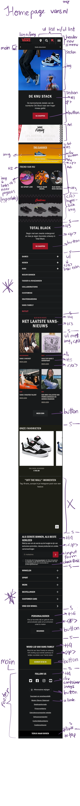
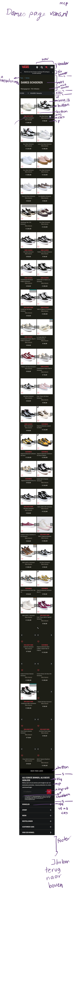

# Procesverslag
Markdown is een simpele manier om HTML te schrijven.  
Markdown cheat cheet: [Hulp bij het schrijven van Markdown](https://github.com/adam-p/markdown-here/wiki/Markdown-Cheatsheet).

Nb. De standaardstructuur en de spartaanse opmaak van de README.md zijn helemaal prima. Het gaat om de inhoud van je procesverslag. Besteedt de tijd voor pracht en praal aan je website.

Nb. Door *open* toe te voegen aan een *details* element kun je deze standaard open zetten. Fijn om dat steeds voor de relevante stuk(ken) te doen.

## Jij

  
uitwerken voor kick-off werkgroep

  ### Auteur:
  Maya Coelho

  link github [mayze2001.github.io](https://mayze2001.github.io/FED/)

  #### Je startniveau:
  blauw

  #### Je focus:
  responsive
 

## Je website

  
uitwerken voor kick-off werkgroep

  ### Je opdracht:
  (https://www.vans.nl/)

  #### Screenshot(s) van de eerste pagina (small screen): 
  Home pagina  
  

  #### Screenshot(s) van de tweede pagina (small screen):
  women shoes pagina  
  
 

## Toegankelijkheidstest 1/2 (week 1)

  
uitwerken na test in 2e werkgroep

  ### Bevindingen
  Lijst met je bevindingen die in de test naar voren kwamen:

De pagina heeft in het algemeen weinig kleurgebruik, waardoor mensen met kleurblindheid er geen problemen mee zullen hebben. 
Er wordt gebruik gemaakt van descriptieve teksten bij de error messages, waardoor dit ook voor kleurblinden duidelijk blijft.
De keyboard navigator is niet compleet. Bij het einde van de pagina kan je niet door klikken en blijft deze vast zitten.
Het is niet compleet responsive, want als je een mobiel apparaat op horizontaal zet, moet je de pagina opnieuw laden, want hij is anders niet goed weergeefbaar.
Ook kan je bij horizontaal niet goed op de nav klikken, de tekst overlapt.
In de code van de site kan je geen H1 vinden. Ook op het moment van testen met de narrator, kon je merken dat er niet genoeg heading levels zijn, waardoor het luisteren hier naar heel verwarrend is.
De alt van de afbeeldingen zijn niet descriptief, ze zeggen alleen welke categorie schoen het is maar omschrijven het product niet.
Er waren geen videos of audios, dus hier kon ik ook geen tests mee uitvoeren.
Verder waren er ook geen flashy animaties, alleen een paar bewegingen in de banners die heel sloom bewogen met de hover functie.
De kleuren die de site gebruikt (rood, wit & zwart) hebben goed contrast, alles is leesbaar.
Filters worden niet voorgelezen door de narrator, alleen de eerste categorie hiervan wordt voorgelezen als een H2.

## Breakdownschets (week 1)

  
uitwerken na afloop 3e werkgroep

## Home page 

## Dames page

## Voortgang 1 (week 2)

  
uitwerken voor 1e voortgang

  ### Stand van zaken
Ik vond het weer even moeilijk om weer te beginnen met coderen maar nu ik eenmaal ben begonnen is het alleen maar kwestie van verder werken.

  ### Verslag van meeting
  
Feedback: De eerste banner proberen in de header te zetten. Een section maken van de artikels van de schoenen op de dames schoenen page.
Bedenken als microinteractie: producten in de winkel mand zetten, dus als je op het plusje drukt dat het dan als nummertje naast het mandje verschijnt.

## Voortgang 2 (week 3)

  
uitwerken voor 2e voortgang

  ### Stand van zaken
 Vragen voor student assistent:
 1) waarom gaat de image raar strectchen als ik max width zet?
2) waarom gaat de text van mijn 3e section (gele background) onder elkaar in plaats van naast elkaar?

  ### Verslag van meeting

Feedback: class op de body van elke pagina zetten zodat de css niet in de war raakt als ik nth of type gebruik op het moment van properties toevoegen.
Ook minder classes gebruiken waar mogelijk. De algemene site margins weg halen zodat mijn site goed tot de rand zichtbaar is.

## Toegankelijkheidstest 2/2 (week 4)

  
uitwerken na test in 9e werkgroep

  ### Bevindingen
  1. De screen reader/narrator leest alle elementen in volgorde voor.
  2. Het geeft het lijst nummer van de li elementen aan.
  3. Het leest de level van de H elementen voor.
  4. Leest gallery elementen goed voor, eerst de alt tekst van de afbeelding en dan de tekst dat erbij hoort.
  5. De paragraven zijn goed verdeelt, zodat alle tekst per levels duidelijk kan worden voorgelezen.

In vergelijking met de daadwerkelijke "vans.nl" is deze wat beter te navigeren met de screen reader, hij leest hier wel alles voor en gaat in de juiste volgorde, ook geeft de narrator aan waar 
klikbaare links zijn en waar niet. Over het algemeen vondt ik mijn website veel beter te werken voor de screen reader dan de echte website. Dit kan liggen aan dat ik de juiste elementen en volgorde heb gebruikt in
de html. In de code van de echte website kon ik niet zo goed zien wat er in dit aspect in de code fout ging, maar in het kort, wat ik tot nu toe heb op mijn website versie werkt veel toegankelijker dan de echte
webshop die ik na maak.

## Voortgang 3 (week 4)

  
uitwerken voor 3e voortgang

  ### Stand van zaken
  Ik liep best achter maar ging kijhard aan het werk en heb heel veel gedaan nog. Had wat problemen maar zijn allemaal goed gekomen.

  ### Verslag van meeting
  hier na afloop snel de uitkomsten van de meeting vastleggen

  - schoenen in artikel zetten
  - opschieten
  
 

## Eindgesprek (week 5)

  
uitwerken voor eindgesprek

  ### Je uitkomst - karakteristiek screenshots:
  

  ### Dit ging goed/Heb ik geleerd: 
  Korte omschrijving met plaatjes

  

  ### Dit was lastig/Is niet gelukt:
  Korte omschrijving met plaatjes

  

## Bronnenlijst

  
continu bijhouden terwijl je werkt

  Nb. Wees specifiek ('css-tricks' als bron is bijv. niet specifiek genoeg). 
  Nb. ChatGpT en andere AI horen er ook bij.
  Nb. Vermeld de bronnen ook in je code.

  1. bron 1
  2. bron 2
  3. ...

